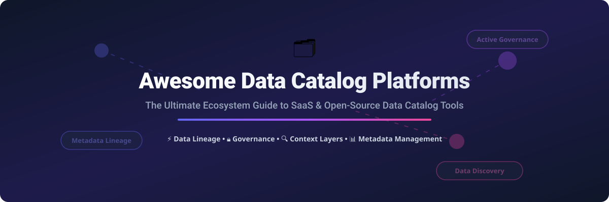

# 🗂️ Awesome Data Catalog Platforms & Active Metadata Ecosystem 🚀



<p align="center">
  <a href="https://github.com/ishandutta2007/Awesome-Awesome-Awesome"></a><a href="https://discord.gg/jc4xtF58Ve"></a>
  <a href="https://github.com/ishandutta2007/Awesome-Data-Catalog-Platform/stargazers"></a>
  <a href="https://github.com/ishandutta2007/Awesome-Data-Catalog-Platform/network/members"></a>
  <a href="https://github.com/ishandutta2007/Awesome-Data-Catalog-Platform/blob/main/LICENSE"></a>
  <a href="https://github.com/ishandutta2007/Awesome-Data-Catalog-Platform/pulls"></a>
  <a href="https://github.com/ishandutta2007"></a>
</p>

---

## 📌 Ecosystem Overview & Data Discovery Architecture

A curated, comprehensive reference guide to modern **Data Catalog Platforms**, **Active Metadata Engines**, **Automated Data Lineage**, **Business Glossaries**, and **Data Governance Systems**.

Whether you are scaling cloud data warehouses (Snowflake, Databricks, BigQuery), standardizing governance across enterprise data lakes, or enabling AI agent context layers, choosing the right metadata catalog is critical for modern data engineering and analytics stack productivity.

---

## 📑 Table of Contents
- [📊 Market Insights & Sector Overview](#-market-insights--sector-overview)
- [🏢 Enterprise SaaS & Hosted Platforms](#-enterprise-saas--hosted-platforms)
- [🔓 Open-Source GitHub Projects](#-open-source-github-projects)
- [🏗️ Architectural Reference & Patterns](#%EF%B8%8F-architectural-reference--patterns)
- [🤝 How to Contribute](#-how-to-contribute)
- [📈 Star History](#-star-history)
- [💖 Support & Sponsorship](#-support--sponsorship)
- [📜 Disclaimer](#-disclaimer)

---

## 📊 Market Insights & Sector Overview

> **Market Size Estimate:** The global Data Catalog market size was estimated at **~$1.4 Billion in 2024** and is projected to reach **~$4.2 Billion by 2030** (CAGR of ~20.1%).  
> **Sector Concentration:** The market structure is **moderately fragmented**, transitioning from legacy monolithic governance suites (Collibra, Informatica, IBM) to modern active metadata platforms (Atlan, Alation, DataHub/Acryl) without a single winner-take-all monopoly.

---

## 🏢 Enterprise SaaS & Hosted Platforms

Below is a curated comparison of top commercial and managed Data Catalog platforms, **sorted by company valuation / revenue scale (descending)**.

| Platform / Product | Company Size (Valuation / Revenue) | Starting Price (Paid Tier) | Free Tier / Trial Limit | Key Focus & Core Strengths |
| :--- | :--- | :--- | :--- | :--- |
| **[Microsoft Purview](https://azure.microsoft.com/products/purview/)** ⚡ | ~$3.1 Trillion (Market Cap) | **$0.40 / vCore-hr** (Data Map Base Compute) | **30-day free trial** (up to 2,000 Data Map capacity units) | Unified cloud data governance & catalog tightly integrated into Azure & M365 estates. |
| **[IBM Watson Knowledge Catalog](https://www.ibm.com/products/watson-knowledge-catalog)** 🏢 | ~$200 Billion (Market Cap) | **$300 / month** (Standard Plan on IBM Cloud) | **Lite Free Plan** (Forever free: 1 catalog, up to 50 data assets, 1 user) | Enterprise catalog & AI governance integrated into IBM Cloud Pak & Watson portfolio. |
| **[Informatica Enterprise Data Catalog (EDC)](https://www.informatica.com/)** 🏭 | ~$8.5 Billion (Market Cap / $1.6B Rev) | **$2,000 / month** (IDMC IPU Consumption Tier) | **30-day free trial** (includes 500 IDMC execution credits) | Deep enterprise metadata discovery, lineage, and compliance across hybrid multi-cloud systems. |
| **[Collibra Data Catalog](https://www.collibra.com/)** 🏛️ | ~$5.25 Billion (Valuation) | **$170 / user / month** (Base annual plan from ~$120k/yr) | **14-day interactive test-drive** (Guided sandbox environment) | Industry benchmark for enterprise data governance, stewardship workflows, and regulatory compliance. |
| **[Alation](https://www.alation.com/)** 🔍 | ~$1.7 Billion (Valuation) | **$199 / user / month** (Base enterprise instance from ~$50k/yr) | **14-day guided sandbox** (Pre-loaded with sample enterprise data schemas) | Pioneer in data intelligence, query-driven metadata discovery, SQL analytics, and team collaboration. |
| **[Atlan](https://atlan.com/)** 🚀 | ~$750 Million (Valuation) | **$1,250 / month** (Starter Team Plan, billed annually) | **14-day full-feature trial** (Connect up to 5 data sources) | Active metadata platform built for modern cloud stacks (Snowflake, dbt, Databricks, Fivetran). |
| **[CastorDoc](https://www.castordoc.com/)** 📝 | ~$100 Million (Valuation) | **$499 / month** (Growth Tier for up to 10 users) | **14-day free trial** (Unlimited metadata ingestion during trial) | Collaborative documentation catalog focused on analytics team productivity & data context. |
| **[Secoda](https://www.secoda.co/)** 🤖 | ~$80 Million (Valuation) | **$400 / month** (Base Team Plan) | **Free Forever Plan** (Up to 5 team members & 1 data warehouse connection) | AI-assisted data catalog, internal search engine, and knowledge management platform. |
| **[Acryl Data (Managed DataHub)](https://datahubproject.io/)** 🌐 | ~$70 Million (Valuation) | **$500 / month** (Acryl Cloud Developer Tier) | **14-day free trial** (Acryl Cloud fully managed sandbox instance) | Commercial SaaS and managed active metadata platform built on top of open-source DataHub. |
| **[Select Star](https://www.selectstar.com/)** ✨ | ~$40 Million (Valuation) | **$300 / month** (Starter Plan including 1 connection & 5 users) | **14-day free trial** (Full automated lineage & column-level usage analytics) | Automated data discovery and column-level lineage engine designed for modern warehouses. |
| **[OvalEdge](https://www.ovaledge.com/)** 🛡️ | ~$35 Million (Valuation) | **$150 / user / month** (Base server starting $1,000/mo) | **14-day free trial** (Up to 3 data connector setups) | All-in-one data catalog and governance tool offering cost-effective connectors and data literacy tools. |
| **[Alex Solutions](https://www.alexsolutions.com/)** 📊 | ~$25 Million (Valuation) | **$850 / month** (Professional Enterprise Package) | **30-day proof-of-concept trial** (Dedicated test environment upon request) | Enterprise metadata management and business process lineage platform. |

---

## 🔓 Open-Source GitHub Projects

The open-source data catalog ecosystem offers powerful, production-grade tools. Below are top repositories **sorted strictly by GitHub Stars_Count (descending)**.

1. **[OpenMetadata](https://github.com/open-metadata/OpenMetadata)** 🌟  
   [](https://github.com/open-metadata/OpenMetadata/stargazers)  
   *Unified open-source metadata platform providing schemas, data lineage, data quality metrics, business glossaries, and comprehensive REST/gRPC APIs out of the box.*

2. **[DataHub](https://github.com/datahub-project/datahub)** 🔭  
   [](https://github.com/datahub-project/datahub/stargazers)  
   *Extensible open-source metadata platform originally developed by LinkedIn for real-time metadata ingestion, continuous column-level lineage, graph-based discovery, and search.*

3. **[CKAN](https://github.com/ckan/ckan)** 🌐  
   [](https://github.com/ckan/ckan/stargazers)  
   *The world's leading open-source data portal platform used by governments, public institutions, and open-data initiatives globally for cataloging and publishing datasets.*

4. **[Amundsen](https://github.com/amundsen-io/amundsen)** 🧭  
   [](https://github.com/amundsen-io/amundsen/stargazers)  
   *Lightweight data discovery and metadata engine created at Lyft to improve analyst productivity by indexing data assets and query patterns.*

5. **[SchemaSpy](https://github.com/schemaspy/schemaspy)** 🕸️  
   [](https://github.com/schemaspy/schemaspy/stargazers)  
   *Java-based database metadata analyzer that generates HTML visual diagrams and schema reports covering tables, keys, relationships, and data structure cardinality.*

6. **[Apache Gravitino](https://github.com/apache/gravitino)** 🌌  
   [](https://github.com/apache/gravitino/stargazers)  
   *High-performance, open-source multi-catalog federated metadata service providing unified data governance across cloud stores, relational databases, and AI data lakes.*

7. **[OpenLineage](https://github.com/OpenLineage/OpenLineage)** 🔗  
   [](https://github.com/OpenLineage/OpenLineage/stargazers)  
   *An open standard and framework for collecting operational lineage metadata from data pipelines, Spark jobs, Airflow DAGs, and dbt models.*

8. **[Marquez](https://github.com/MarquezProject/marquez)** 📉  
   [](https://github.com/MarquezProject/marquez/stargazers)  
   *Open-source metadata management service focused on dataset availability, job run tracking, and operational lineage; serves as the reference implementation of OpenLineage.*

9. **[Apache Atlas](https://github.com/apache/atlas)** 🐘  
   [](https://github.com/apache/atlas/stargazers)  
   *Enterprise-grade open-source metadata governance framework deeply integrated into Apache Hadoop, Apache Hive, and traditional big data stacks.*

10. **[Spline](https://github.com/AbsaOSS/spline)** ⚡  
    [](https://github.com/AbsaOSS/spline/stargazers)  
    *Automated data lineage tracking engine designed specifically for Apache Spark jobs and complex data processing pipelines.*

11. **[Magda](https://github.com/magda-io/magda)** 🇦🇺  
    [](https://github.com/magda-io/magda/stargazers)  
    *Open-source federated data catalog system built for cloud-native deployment, multi-source ingestion, and automated metadata harvest.*

---

## 🏗️ Architectural Reference & Patterns

```
                               ┌───────────────────────────┐
                               │     Data Producers        │
                               │  Snowflake / Databricks   │
                               │   dbt / Airflow / Kafka   │
                               └─────────────┬─────────────┘
                                             │ (Events / Lineage API)
                                             ▼
                               ┌───────────────────────────┐
                               │  Active Metadata Catalog  │
                               │  (DataHub / OpenMetadata) │
                               └─────────────┬─────────────┘
                                             │
                       ┌─────────────────────┴─────────────────────┐
                       ▼                                           ▼
         ┌───────────────────────────┐               ┌───────────────────────────┐
         │     Data Governance       │               │    Data Consumers & AI    │
         │  Glossary, Access Control │               │ Analyst Search, LLM RAG   │
         └───────────────────────────┘               └───────────────────────────┘
```

### Key Considerations When Choosing a Platform:
1. **Self-Hosted vs. Managed Cloud:** Engineering-heavy organizations often succeed with **DataHub** or **OpenMetadata** deployed on Kubernetes (EKS/GKE). Teams seeking turnkey setup prefer SaaS platforms like **Atlan** or **Alation**.
2. **Column-Level Lineage Requirements:** If tracking granular transformation lineage across SQL queries and dbt pipelines is a primary requirement, ensure the platform native support for **OpenLineage** integration or built-in query parsing.
3. **Data Quality & Observability Integration:** Platforms like **OpenMetadata** bundle data quality checks and freshness monitoring directly into the catalog.

---

## 🤝 How to Contribute

We welcome contributions from the global data engineering community!

1. **Fork the repository** on GitHub.
2. Create a feature branch (`git checkout -b add-new-catalog`).
3. Add or update platform details adhering to our strict pricing and valuation structure.
4. Open a **Pull Request** with a detailed explanation of your changes.

Check out our full collection of curated lists on [Awesome-Awesome-Awesome](https://github.com/ishandutta2007/Awesome-Awesome-Awesome)!

---

## 📈 Star History

[](https://star-history.dera.page/#ishandutta2007/Awesome-Data-Catalog-Platform&type=date&legend=top-left)

---

## 💖 Support & Sponsorship

If you find this repository valuable for your data architecture research, data platform engineering, or team evaluation:

- ⭐ **Star this repository** to help others discover it!
- 🔀 **Fork it** to customize your internal architecture evaluation.
- 📢 **Share it** with fellow data engineers, architects, and community members.
- ☕ **Support the maintainer:** Consider buying a coffee or sponsoring on the [GitHub Sponsor Dashboard](https://github.com/sponsors/ishandutta2007).

Thank you for supporting open-source data ecosystem tools!

---

## 📜 Disclaimer

*This list is community-curated for informational and research purposes only. Product names, logos, prices, and valuations belong to their respective owners. Feature sets and prices change frequently; please consult official provider documentation before making purchasing or architectural decisions.*

---

<p align="center">
  Made with ❤️ for the global Data Engineering &amp; Governance Community.
</p>
